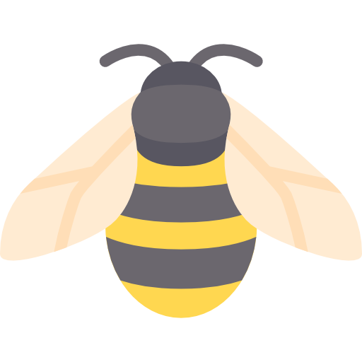

# Cookbook


<p align="center">
  
</p>

Describe here what you are building...

## Get started

### 🐋 Quick start (Docker)

Update `.env.dev` with missing tokens/values.

```
# Update database with latest changes
./scripts/migrate.sh

# Get everything up
docker-compose up -d
```

### 👨‍💻 Bootstrap (Local development)

Setup a [virtual environment for local development](https://uoa-eresearch.github.io/eresearch-cookbook/recipe/2014/11/26/python-virtual-env/) by running [`./scripts/setup-env.sh`](./scripts/setup-env.sh).

Activate your virtualenv by running `source .venv/bin/activate`

Once using your virtualenv, run [`./scripts/bootstrap.sh`](./scripts/bootstrap.sh).

### 📨 Produce events

If you wish to produce an event to the the consumer, you can:

```bash
./scripts/produce_task.sh
```

### 📬 Check consuming logs

You can watch what's going on in your consumer by running:

```bash
docker-compose logs --follow faust
```

## 🔛 Kafka Topics

We’re going to produce/consume the following Kafka topics:

| Topic          | Propagation                                                       |
| -------------- | ----------------------------------------------------------------- |
| `SOME_TOPIC_1` | **Consume** Describe here the purpose of consume this topic...    |
| `SOME_TOPIC_2` | **Produce** Describe here the purpose of produce to this topic... |

## URLs

You find the endpoints' method, url, and description in the table bellow.

| Method | Endpoint URL | Description                                                                           |
| ------ | ------------ | ------------------------------------------------------------------------------------- |
| `GET`  | `health/`    | [Application health check](https://github.com/KristianOellegaard/django-health-check) |
| `POST` | `graphql/`   | [Receive grahpql queries mutations and subscriptions](#/graphql/)                     |
| `GET`  | `graphql/`   | [GraphiQL interface](#/graphql/)                                                      |
